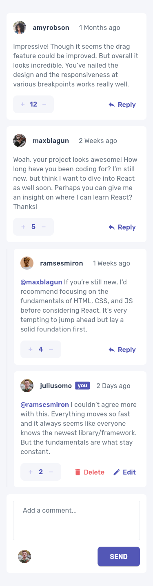

# Frontend Mentor - Interactive comments section solution

This is a solution to
the [Interactive comments section challenge on Frontend Mentor](https://www.frontendmentor.io/challenges/interactive-comments-section-iG1RugEG9).
Frontend Mentor challenges help you improve your coding skills by building realistic projects.

## Table of contents

- [Overview](#overview)
    - [The challenge](#the-challenge)
    - [Screenshot](#screenshot)
    - [Links](#links)
- [My process](#my-process)
    - [Built with](#built-with)
    - [What I learned](#what-i-learned)
    - [Continued development](#continued-development)
    - [Useful resources](#useful-resources)
- [Author](#author)
- [Acknowledgments](#acknowledgments)

## Overview

### The challenge

Users should be able to:

- Create, Read, Update, and Delete comments and replies
- Upvote and downvote comments
- Keeping state of the site with SQLite database
- Change the user that's currently logged in by clicking the bottom left avatar

### Screenshot

### Links

- Solution URL: [GitHub](https://github.com/JustANipple/interactive_comments_section)
- Live Site URL: [FireBae](https://interactive-comments-6768e.web.app/)

## My process

### Built with

- Flutter
- Dart
- Firebase
- SQLite
- Mobile-first workflow

### What I learned

This has been the first time i built a full stack app in Flutter, so it was quite challenging
SQLite was a good choice for this challenge as it's a simple database that can be used to store
comments and replies.
Flutter has a nice way to manage state, which is really useful when you need to update UI after an
action is done.

### Continued development

I will continue studying on layout for the Flutter part and structure for the backend (Dart)

### Useful resources

- [SQLite getting started](https://www.sqlitetutorial.net/sqlite-getting-started/) - This was a good
  resource to setup SQLite for the first time.
- [Flutter docs](https://docs.flutter.dev/) - Flutter has nice documentation for everything you need
  to know.

## Author

- Frontend Mentor - [@JustANipple](https://www.frontendmentor.io/profile/JustANipple)

## Acknowledgments

Since frontendmentor works with websites and not with app, as a screen result on that site for this
challenge i couldn't get anything other than a blank screen, but VillageR88 gave me a hint to
generate themed loading screen that prevents this to happen, so i added it to the project.
- VillageR88 - [@VillageR88](https://github.com/VillageR88)